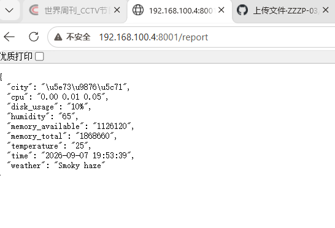

# 系统监控 API 服务

基于 Flask 的轻量级系统监控 API，支持 CPU/内存/磁盘监控、天气查询、数据历史存储。

## 功能

- 系统状态查询：`/report`
- 城市天气查询：`/weather?city=郑州`
- 当前时间：`/now`
- 历史记录存储（SQLite）

## 运行

```bash
pip install flask requests
python3 init_db.py
python3 api_flask.py
## 运行效果


