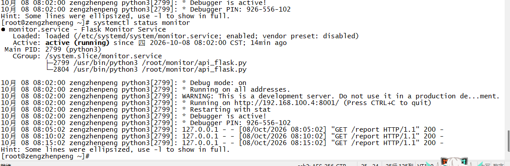
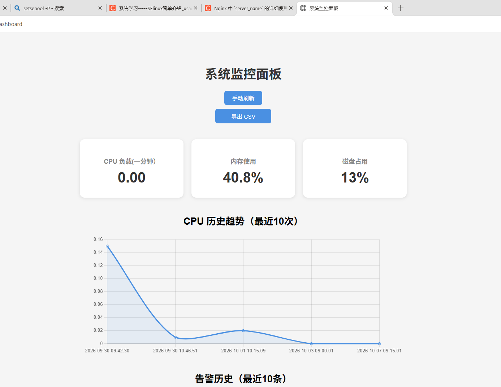
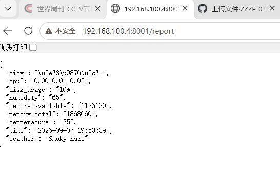
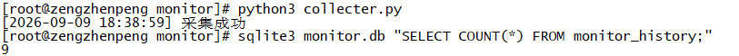
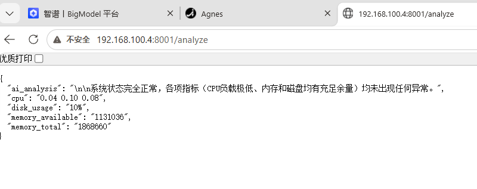
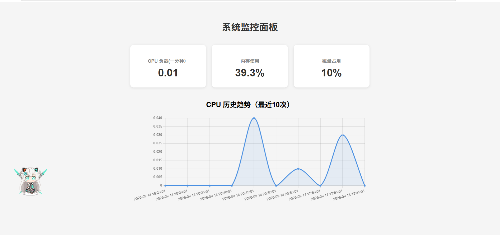
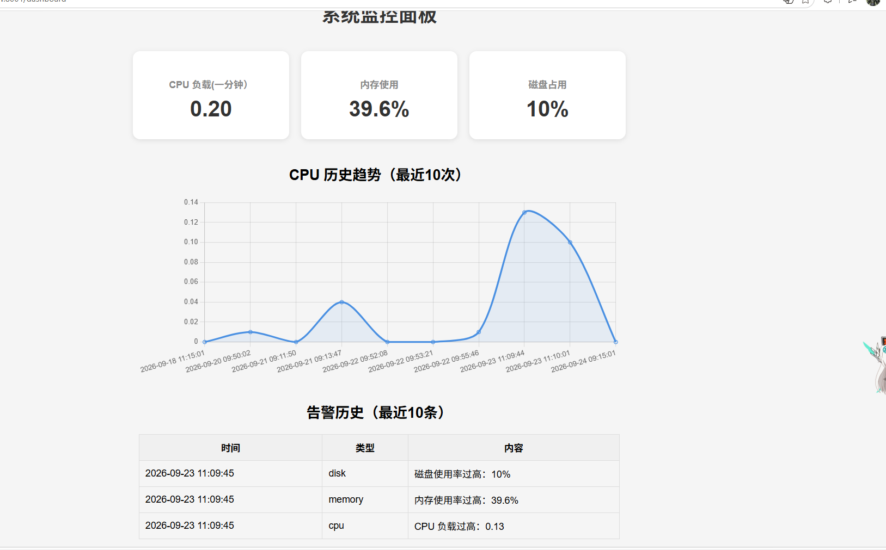
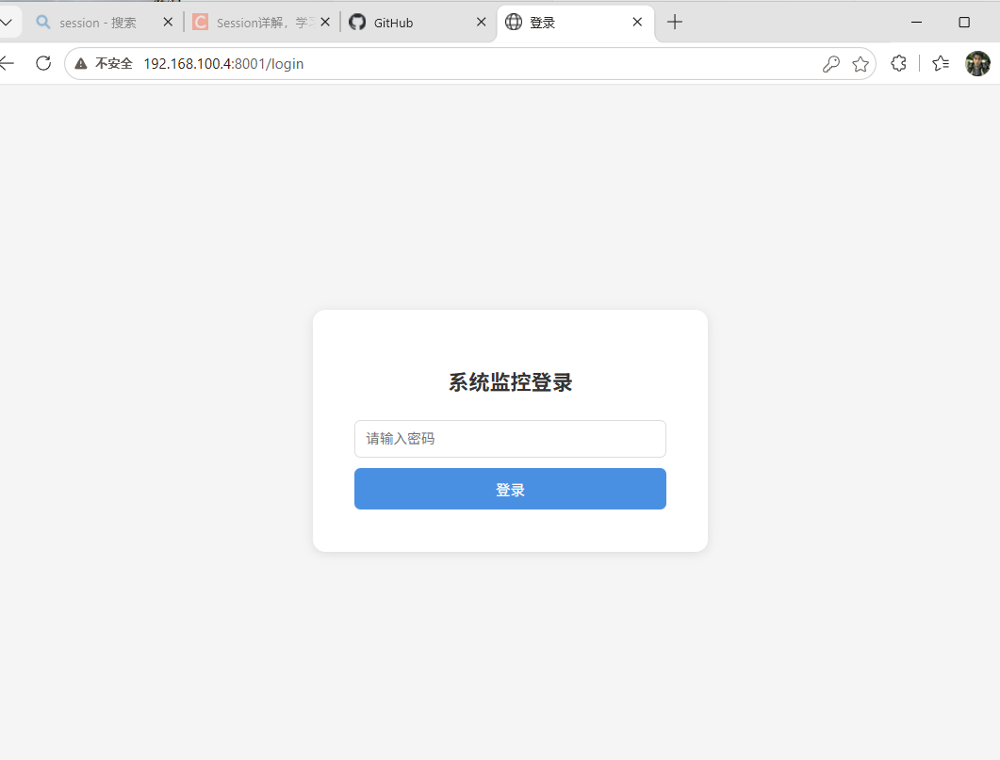

# 系统监控 API 服务

基于 Flask 的轻量级系统监控 API，支持 CPU/内存/磁盘监控、天气查询、数据历史存储。

## 功能

- 系统状态查询：`/report`
- 城市天气查询：`/weather?city=郑州`
- 当前时间：`/now`
- 历史记录存储（MyLite）

## 环境要求

- Python 3.6+
- MySQL 8.0
- Linux（需要访问 /proc 目录）

## 安装步骤

1. 安装依赖
   pip install -r requirements.txt

2. 创建数据库
   mysql -u root -p
   CREATE DATABASE monitor;
   EXIT;

3. 设置环境变量
   export DB_PASSWORD="你的MySQL密码"

4. 建表
   python3 init_db.py

5. 启动服务
   python3 api_flask.py

## 部署方式

项目通过 systemd 做成系统服务，支持开机自启和崩溃自动重启。

配置 `/etc/systemd/system/monitor.service`：

```ini
[Unit]
Description=Flask Monitor Service
After=network.target mysqld.service

[Service]
Type=simple
WorkingDirectory=/root/monitor
Environment="DB_PASSWORD=..."
Environment="WXPUSHER_TOKEN=..."
Environment="WXPUSHER_UID=..."
Environment="AGNES_API_KEY=..."
Environment="DASHBOARD_PASSWORD=..."
ExecStart=/usr/bin/python3 /root/monitor/api_flask.py
Restart=always
RestartSec=5

[Install]
WantedBy=multi-user.target
```


## Nginx 反向代理

项目通过 Nginx 反向代理部署，访问 80 端口即可，无需指定 8001 端口。



配置示例：

```nginx
server {
    listen 80;
    server_name 192.168.100.4;

    location / {
        proxy_pass http://127.0.0.1:8001;
        proxy_set_header Host $host;
        proxy_set_header X-Real-IP $remote_addr;
    }
}
```

## 运行效果



## 定时采集效果



## AI 分析接口

访问 `/analyze` 会先采集系统状态，然后调用 Agnes AI 分析是否正常，返回 AI 的分析结果。


## 监控面板

访问 `/dashboard` 可以看到一个 Web 页面，显示真实的 CPU、内存、磁盘数据。



## 告警历史

页面下方会显示最近 10 条告警记录。



## 技术博客

- [从零搭建监控系统：用 WxPusher 实现微信告警](https://blog.csdn.net/zzp_03/article/details/166680906)

## 登录保护

访问 `/dashboard` 需要登录，密码从环境变量 `DASHBOARD_PASSWORD` 读取。


